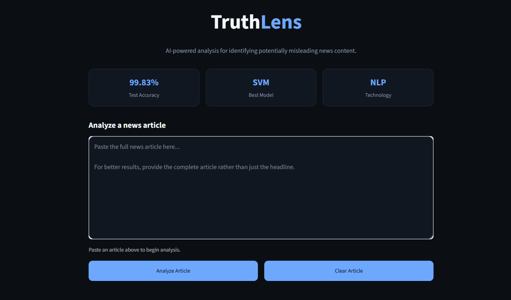

# 🔎 TruthLens — Fake News Detection System

An NLP-powered machine learning system that analyzes news articles and predicts whether they are **REAL** or **FAKE**.

TruthLens uses **TF-IDF feature extraction** and a **Linear SVM classifier**, combined with an interactive Streamlit interface that provides prediction explanations and model performance metrics.

---

## 🚀 Overview

The goal of TruthLens is to demonstrate an end-to-end machine learning pipeline for text classification — from raw news data and NLP preprocessing to model training, evaluation, and deployment through a web interface.

The system can:

- 🧹 Clean and preprocess news articles
- 🔢 Convert text into numerical TF-IDF features
- 🧠 Classify articles using Linear SVM
- 🎯 Predict whether an article is REAL or FAKE
- 🔍 Show important vocabulary features behind predictions
- 📊 Display model performance metrics
- 🌐 Provide an interactive Streamlit web application


---

## 🖥️ Application Preview

### TruthLens Interface

The Streamlit application provides an interactive interface for submitting and analyzing news articles.



---
## 🧠 Machine Learning Pipeline

```text
Raw News Article
       ↓
Text Preprocessing
       ↓
TF-IDF Vectorization
       ↓
Linear SVM Classifier
       ↓
Prediction + Decision Score
       ↓
REAL / FAKE
       ↓
Prediction Explanation